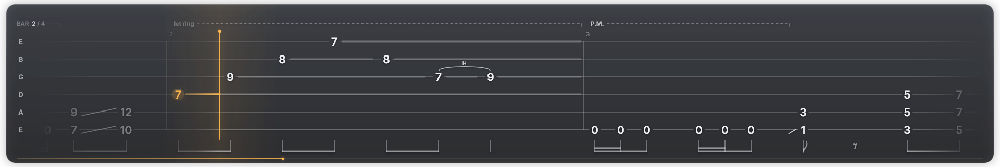
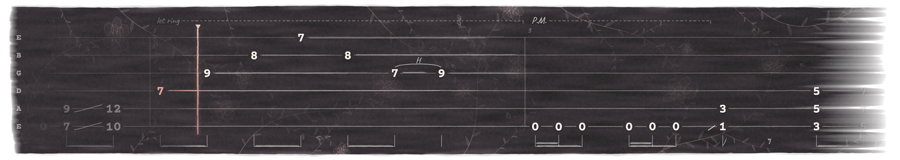

# tabscroll

Turn a Guitar Pro tab into a single-line tab that scrolls from right to left, for playthrough videos.
The output is a video with a transparent background, so you can drop it on top of your footage in any editor.




- **Synced by design.** The tab scrolls at a constant speed, and each note hits the playhead exactly when it's played.
  Line up one point with your recording and the rest of the song stays in sync.
- **Real tab notation.** Hammer-ons and pull-offs (H/P), slides, slides in from above or below, dead notes, ties,
  palm mute and let ring lines, bar numbers, tempo, time signature, and rhythm stems and beams.
- **Live feedback.** Each note flashes as it's played. Held and let-ring notes draw a sustain line that lights
  up while they ring, and notes already played are dimmed.
- **Two looks.** `studio` is clean and polished. `ink` is hand-made, with rose-gold highlights. See [Themes](#themes).
- **Editor-ready output.** ProRes 4444 with alpha for Premiere, Resolve, Final Cut and After Effects,
  WebM VP9 with alpha for OBS and the web, and an MP4 preview.

---

## 1. Install

You need **Python 3.10+** and **ffmpeg**.

```bash
git clone https://github.com/joeypercia/tabscroll.git
cd tabscroll
pip install -r requirements.txt
```

Installing ffmpeg:

| OS | Command |
|---|---|
| Windows | `winget install Gyan.FFmpeg` |
| macOS | `brew install ffmpeg` |
| Linux | `sudo apt install ffmpeg` (or your distro's package) |

Check it works with `ffmpeg -version`. The fonts (Inter, Bravura, Courier Prime and Caveat) come with the repo, so there's nothing else to install.

Try it on the bundled demo:

```bash
python examples/make_demo.py                               # writes examples/demo.gp
python tabscroll.py examples/demo.gp --still 5              # writes still_005.000.png
```

## 2. Get your tab as a `.gp` file

tabscroll reads **Guitar Pro 7 / 8 `.gp` files**. Ways to get one:

- **Songsterr**: open the song, then use the download/export menu and choose Guitar Pro.
- **Guitar Pro 7/8**: open any tab (including old `.gp5`, `.gpx` or `.gp4` files) and save it as `.gp`.
- **Ultimate Guitar** "Official"/Pro tabs and most tab sites offer Guitar Pro downloads. Open the file in Guitar Pro 7/8 and resave it as `.gp` if it's an older format.

Older formats (`.gp3`/`.gp4`/`.gp5`/`.gpx`) aren't read directly. Resave them as `.gp` first.

## 3. Pick the track (and strings)

A `.gp` file usually has several tracks (guitars, bass, drums). List them:

```bash
python tabscroll.py mysong.gp --list-tracks
```

```
track 0: 'Rhythm Guitar'  7 strings, low->high B E A D G B E  notes per string [0:8, 1:123, ...]
track 1: 'Lead Guitar'    6 strings, low->high E A D G B E    notes per string [0:40, ...]
track 2: 'Bass'           4 strings, low->high E A D G        notes per string [0:240, ...]
```

- Choose the track with `--track N`. The default is `0`.
- **Hide a string** with `--drop-strings`. Strings are counted from the **lowest string, starting at 0**.
  Suppose a 7-string track only touches the low string in the intro and you want a normal 6-line tab:
  add `--drop-strings 0`. Notes on hidden strings are removed, and the strip shrinks to fit.
  The `notes per string` list shows how much you'd lose.
- **Relabel the strings** with `--tuning` if you play the tab in a different tuning than it was written in, as long as
  it has the same intervals (e.g. a tab written in C G D G B D, played tuned 3 semitones down):
  `--tuning "A E B E G# B"`, listed low to high. Separate names with spaces, commas or dashes; `#`/`♯` and `b`/`♭` both work.
  Only the labels change; the fret numbers stay the same.

## 4. Preview a frame

Render single PNG frames before committing to a full video. They take a second each:

```bash
python tabscroll.py mysong.gp --track 1 --still 10 --still 42.5 --out check
```

This writes `check_010.000.png` and `check_042.500.png`, where the number is the time in the overlay video.
Add `--bg some_frame_from_your_video.png` to also get a `_comp.png` of the strip placed on your footage.

## 5. Render the video

```bash
python tabscroll.py mysong.gp --track 1 --out renders/mysong
```

By default this writes `renders/mysong_prores4444.mov` and `renders/mysong_vp9alpha.webm`.
Create the `renders/` folder first. Rendering uses every CPU core, and a 3–4 minute song takes a few minutes.

A typical 4K set with both looks:

```bash
python tabscroll.py mysong.gp --scale 2 --out renders/mysong_4k --formats prores,preview
python tabscroll.py mysong.gp --scale 2 --variant clean --out renders/mysong_4k_clean --formats prores
```

### Options

| Option | Default | What it does |
|---|---|---|
| `--track N` | `0` | Which track to render (see `--list-tracks`). |
| `--drop-strings 0,1` | none | Hide strings, counted from the lowest string starting at 0. |
| `--tuning "A E B E G# B"` | from file | Relabel the strings, low to high. Labels only; the fret numbers don't change. |
| `--scale` | `1` | `1` gives a 1920-wide strip (for 1080p); `2` gives a 3840-wide strip (for 4K). |
| `--theme` | `studio` | The look: `studio` or `ink`. See [Themes](#themes). |
| `--variant` | `card` | `card` draws the theme's backdrop behind the tab. `clean` shows only the tab, with a soft shadow. |
| `--formats` | `prores,webm` | Any of `prores`, `webm`, `preview` (comma-separated). |
| `--fps` | `60` | Frame rate. Use 30 if your project is 30 fps and you want smaller files. |
| `--preroll` | `3.0` | Seconds before bar 1 reaches the playhead. |
| `--px-per-beat` | `200` | Scroll speed: bigger is faster and more spread out. Try 240–280 for dense 16th-note riffs, 160 for slow songs. |
| `--playhead` | `0.22` | Playhead position, as a fraction of the width. |
| `--accent` | per theme | Highlight color, as hex. Defaults to amber `FFB74D` for studio and rose gold `E49E92` for ink. Try `4FD1FF` cyan, `FF5C7A` pink or `9BE564` green. |
| `--still T` | | Render a PNG at video time `T` instead of a video. Repeatable. |
| `--bg image.png` | | Background for `--still` composites and the `preview` MP4. Without it, previews use a plain dark gradient. |
| `--start S`, `--limit N` | | Render only part of the song (N seconds starting at S), which is handy for quick tests. |
| `--workers N` | cores − 2 | Number of parallel render processes. |

### Output files

| Format | File | Use it for |
|---|---|---|
| `prores` | `*_prores4444.mov` | **Editing.** ProRes 4444 with a true alpha channel, visually lossless. Large (about 1 GB per minute at 1080 width, about 3 GB per minute at 4K). |
| `webm` | `*_vp9alpha.webm` | OBS, browsers and web-based editors. Transparent and small (tens of MB). |
| `preview` | `*_preview.mp4` | Just for looking at: a 16:9 H.264 video with the strip composited on the background. Not transparent. |

The strip is 1920×322 at `--scale 1` or 3840×644 at `--scale 2`. The ink theme is a little taller (1920×342) because it spaces the strings further apart. Both get taller if you keep 7+ strings.

## Themes

Pick one with `--theme`. Both work with `--variant clean`, `--accent` and every other option.

| Theme | Look |
|---|---|
| `studio` (default) | A dark glass card, Inter numbers, glossy amber note chips, comet sustain lines and a soft light behind the playhead. Clean and polished. |
| `ink` | A soft dry-brush stroke of plum-black ink with a light film grain, large typewriter fret numbers (Courier Prime), pen-drawn strings and stems, handwritten notes (P.M., let ring, bar numbers) and rose-gold highlights: a metallic marker for the playhead, and numbers that glow rose gold as they're played. Faint botanical engraving covers the ink: curving stems with veined leaves, layered line-drawn blooms, buds and tendrils, softest behind the strings. There's no bar counter or progress line in this theme. It opens and closes with a brush wipe. |

```bash
python tabscroll.py mysong.gp --theme ink --out renders/mysong_ink --formats prores
```

**Size note:** ProRes compresses every frame separately, so the ink theme's texture and grain make its files
roughly 2–3× larger than studio's (a few GB per minute at 1080 width). The WebM output stays small.

Adding a theme: subclass `Renderer` in `tabscroll.py`, override the hooks you need (`_style` for colors
and fonts, `_build_backdrop`, `pen`, `draw_live`, `draw_playhead`, `draw_hud`, `_finish`), then register
it in `THEMES`. `InkRenderer` is a complete example.

## 6. Put it in your video

### Sync

The console prints the key number when rendering starts:

```
... bar 1 downbeat at 3.000s
```

In the overlay, the **first beat of bar 1 crosses the playhead at exactly `--preroll` seconds** (3.000 s,
which is frame 180 at 60 fps, by default). To line it up:

1. Find the first downbeat of bar 1 in your recording, using the audio waveform or the first pick attack.
2. Put a marker there.
3. Slide the overlay so that its 3-second point lands on your marker. In most editors, move the clip's start to
   *marker − 3.000 s*.

Because the scroll speed is constant, everything after that stays in sync, as long as you recorded to the
same tempo as the tab. If you played to a click at a different BPM, edit the tempo in Guitar Pro first.

### Placement

Put the strip along the bottom of the frame with a little margin, roughly 40 px on a 1080p timeline or 80 px on 4K.
Use the 4K render on 4K timelines. On a 1080p timeline, either render with `--scale 1` or scale the 4K clip to 50%.

### Editor notes

| Editor | What to do |
|---|---|
| **Premiere Pro** | Import the `.mov` and put it on a track above your footage. Transparency works automatically. |
| **After Effects** | Import it. If it asks, choose *Interpret alpha: Straight*. |
| **DaVinci Resolve** | Import it and put it on V2. If you see black around the strip, right-click the clip, open **Clip Attributes**, and set **Alpha Mode** to **Straight**. |
| **Final Cut Pro** | Import and connect it above the primary storyline. ProRes 4444 alpha is native. |
| **OBS** | Add a *Media Source* with the `.webm` file. It's transparent in OBS. |
| **Other editors** | If your editor can't read ProRes 4444 alpha, try the `.webm`. Most modern editors support one of the two. |

## 7. What gets drawn

| On screen | Meaning |
|---|---|
| Vertical line (amber, or a rose-gold marker in ink) | The playhead: notes are played as they cross it. |
| Chip flash (ink: the number glows rose gold) | A note being struck. |
| Line along a string | The note sustains (tied, let ring, or longer than a beat). It lights up while it rings. |
| `(5)` in parentheses | A tie carried into a new bar, so you can still see which fret is held. |
| Arc with **H** / **P** | Hammer-on or pull-off. |
| Diagonal line between notes | Slide. A short line before a note means a slide into it. |
| `×` | Dead or muted note. |
| `P.M. - - - -┐` / `let ring - - -┐` | Palm mute and let ring spans. |
| Stems and beams under the tab | Rhythm (8ths, 16ths, dots and rests). |
| Dimmed notes on the left | Already played. |
| `BAR 13 / 42` (top left, studio theme) | Current bar and total bars. |
| Thin line along the bottom (studio theme) | Progress through the song. |

## Limitations

- Only the first voice of a track is drawn. Multi-voice tabs lose the second voice.
- Not drawn yet: bends, vibrato, harmonics, tapping, whammy, tuplet brackets, repeats (use a tab with repeats written out),
  or chord names and lyrics.
- Tempo changes placed at the start of a bar are timed correctly, but the playhead's beat pulse follows the first tempo.
- Drum tracks aren't supported. It's meant for fretted instruments (guitar and bass).

## How it works

`tabscroll.py` unzips the `.gp` file and parses `Content/score.gpif` (Guitar Pro's XML score). It then works out
note timings, tie chains, let-ring lengths, legato pairs and beam groups. For each frame, it draws the visible
part of the tab with [skia-python](https://github.com/kyamagu/skia-python). Masks, shadows and compositing
happen in numpy/OpenCV, and a multiprocessing pool streams the frames to ffmpeg.

`examples/make_demo.py` builds the bundled demo, an original riff stored in a minimal `.gp` container that
only includes what tabscroll reads.

## License

Code: MIT. Fonts: [Inter](https://github.com/rsms/inter), [Bravura](https://github.com/steinbergmedia/bravura),
[Courier Prime](https://github.com/quoteunquoteapps/CourierPrime) and [Caveat](https://github.com/googlefonts/caveat),
all under the SIL Open Font License 1.1 (see `fonts/`).
